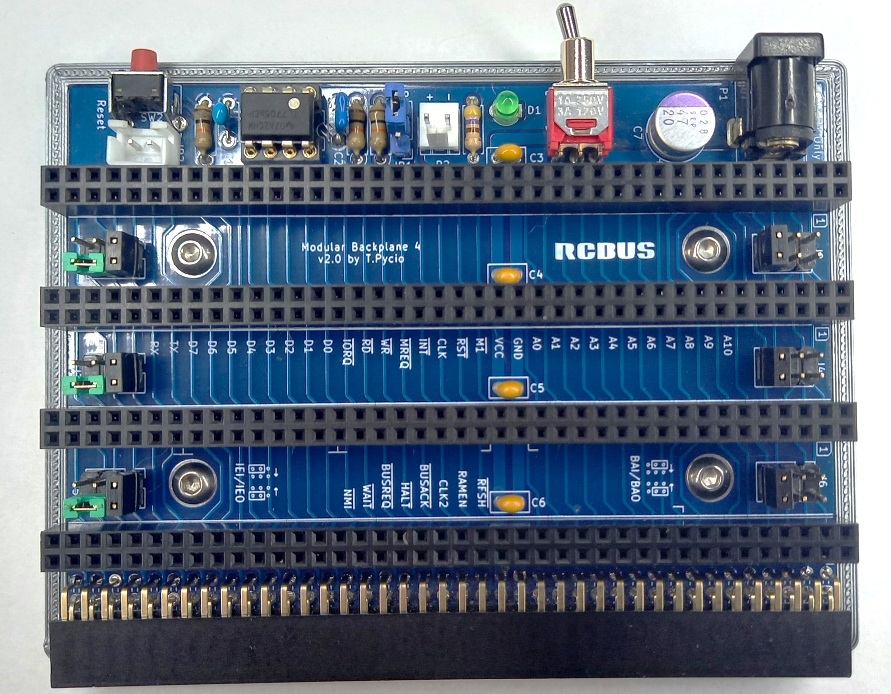

# Backplane4
Backplane 4+1 for RCBus

## Hardware Documentation

### Schematic

[Schematic - Version 2.0](Schematic.pdf)

### Jumpers and Connectors

#### JP1 - Auto Reset

| Position | Description |
| -------- | ----------- |
| 1-2      | enable      |
| 2-3      | disable     |

## Bill of Materials

| Component type     | Reference | Description                                 | Quantity |
| ------------------ | --------- | ------------------------------------------- | -------- |
| PCB                |           | Backplane4 PCB - Version 2.0                | 1        |
| Integrated Circuit | U1        | TL7705A - 5-V supervisor, 8 pin DIP         | 1        |
| LED                | D1        | LED indicator, 3mm                          | 1        |
| Switch             | SW1       | Switch ON-ON, TSSM1022C3, SMTS-102C3        | 1        |
| Button             | SW2       | 6x6 Right Angle Tactile Push Button         | 1        |
| Resistor           | R1 - R3   | 10 kohm, 0.25 W, axial                      | 3        |
| Resistor           | R4        | 470 ohm, 0.25 W, axial                      | 1        |
| Capacitor          | C1        | 10 nF, 50V, MLCC, 5 mm pitch                | 1        |
| Capacitor          | C2        | 0.1 uF, 50V, MLCC, 5 mm pitch               | 1        |
| Capacitor          | C3 - C6   | 0.1 uF, 50V, MLCC, 2.5 mm pitch             | 4        |
| Capacitor          | C7        | 47 uF, 10V, electrolytic, 3.8 mm pitch      | 1        |
| DC Supply          | P1        | DC supply socket, male, soldering, 5.5/2.1  | 1        |
| Power Socket       | P2        | Socket, wire-board, male, 2.45 mm pitch     | 1        |
| Connector          | S1 - S4   | Pin strips, 2x40 female, straight, 2.54mm   | 4        |
| Connector          | S5        | Pin strips, 2x40 female, angled 90°, 2.54mm | 1        |
| Pin Header         | J1 - J6   | 2x2 pin header, 2.54 mm pitch               | 6        |
| Pin Header         | JP1       | 1x3 pin header, 2.54 mm pitch               | 1        |
| Connector          | JP2       | 2 pin JST XH2.54 socket male                | 1        |

## Production files
Gerber files prepared for production at JLCPCB(backplane4-JLCPCB.zip)
Mounting plate base for 3d printing(RCBus4.stl)

## License

Copyright 2024 Tadeusz Pycio

This work is licensed under a [Creative Commons Attribution-NonCommercial 4.0 International (CC BY-NC 4.0) ](https://creativecommons.org/licenses/by-nc/4.0/).
